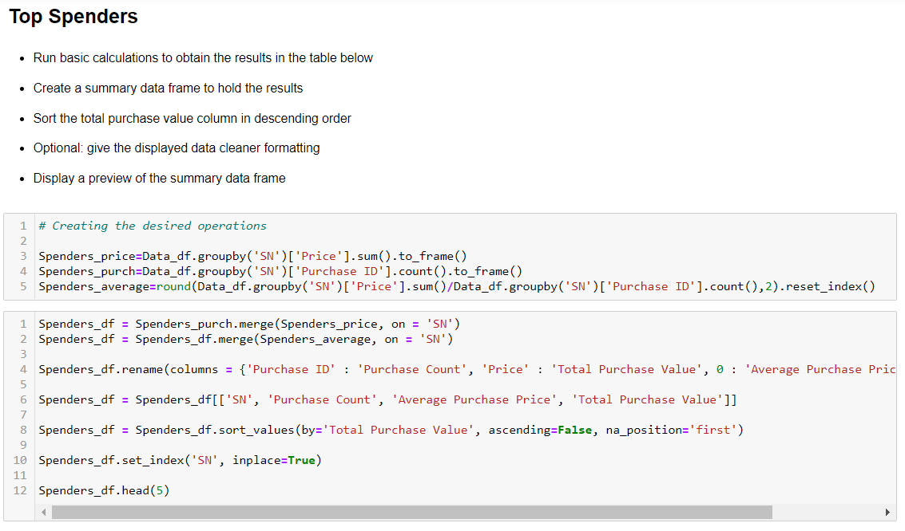

# Videogames analysis

## By Erick Hernandez

In this project I was able to demonstrate my DataFrame handling and analysis. This project was about performing a top-down analysis of a database of fictional videogames, in which I was required to identify trends regarding customer purchasing preferences, their demographics and videogame composition.

For example, here is the written code for top spenders identification:

This challenge involves the usage of Pandas library, from which I mainly used:
    · Merging, dropping and filling
    · CSV import
    · Groupby objects

Conclusions:

It seems that males aged 20-24 are most likely to spend more on videogame purchasing than any other studied group. I would suggest to deeper dive on the preferences for this group in order to maximise its revenues.
Secondary groups such as males and females from 15-19 y.o. have a great potential to growth. Further marketing strategies to increase the player base is highly recommended.
